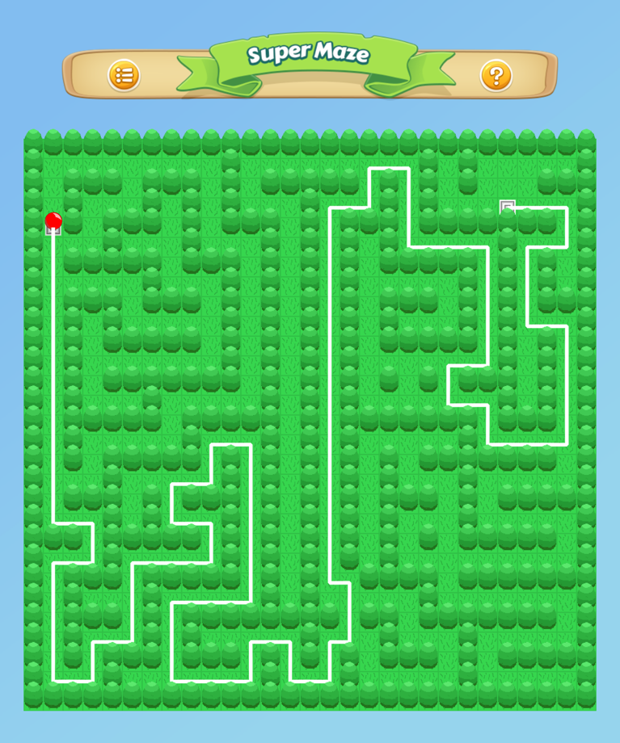

# Super Maze

**Super Maze** is a programmatic maze generator and solver, built with Swift 3.

The intent of this playground is to demonstrate how to create a **virtually** unlimited amount of tile-based maps, each one different from the other: you control a red ball, and your aim is to complete the maze as fast as possible... tilting the device.

## About

Super Maze represents my scholarship application for Apple's WWDC17: I started working on it on March, 22nd and submitted the project on April, 1st.

It's built using SpriteKit, while the ball movements are handled via accelerometer data received from CoreMotion.

## Technical Informations

Mazes are represented by a bi-dimensional matrix, which contains informations about the nodes of the map.

The algorithm used to carve the labirinth is a simple "Depth-first" search, with recursive backtracking.

While this ensures the correctness of the level, it does not provide any informations about its "difficulty": that's why this project makes use of a Swift implementation of the A* search algorithm.

You can find more informations about how this works, in the main page of the playground.

## Maze Generation

## Maze Solving

