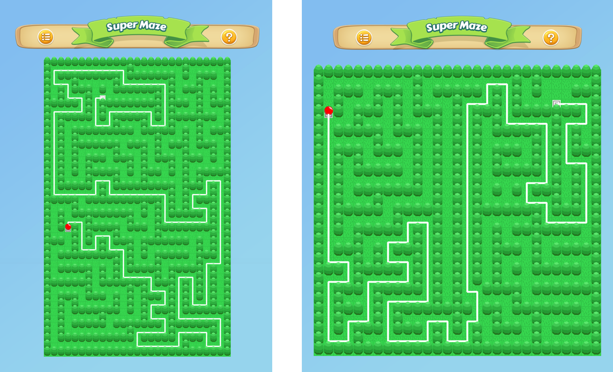

# Super Maze

**Super Maze** is a programmatic maze generator and solver, built with Swift 3.

The intent of this playground is to demonstrate how to create a **virtually** unlimited amount of tile-based maps, each one different from the other: you control a red ball, and your aim is to complete the maze as fast as possible... tilting the device.

# Maze Generation

# Maze Solving

